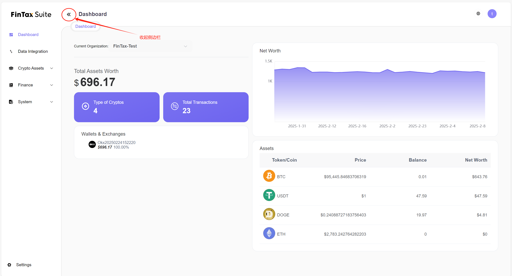
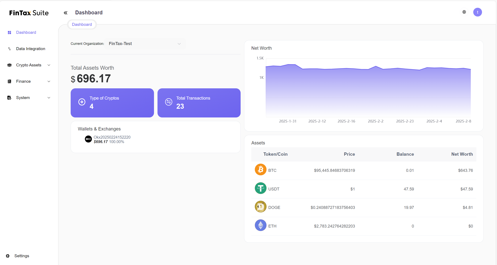
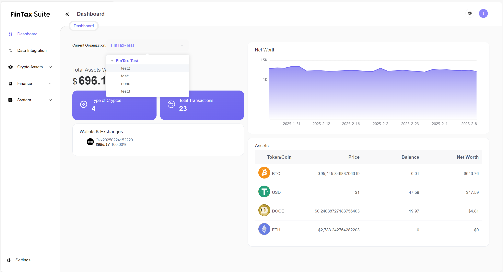

# Dashboard - 看板

## **功能概述(Overview):**

`FinTax Suite`提供标准的加密货币资产看板，以便用户可快速地了解每一个组织节点下的加密资产情况，看板中会展示近期净值波动，钱包净值情况，已经资产净值情况。

## **部分界面UI操作描述(Descriptions of some UI operations):**

### **展开/收起左侧边栏**

<figure><figcaption>
收起侧边栏
</figcaption></figure>

<figure><figcaption>
展开侧边栏
</figcaption></figure>

### **切换语言(Language):**

<figure><figcaption></figcaption></figure>

### **界面描述和操作(UI Description):**

<figure><figcaption>
这是DashBoard首页的展示图
</figcaption></figure>

<figure><figcaption>
这里点击Current Organization可以展示组织以及下属组织进行查看
</figcaption></figure>

* **Current Organization 当前组织** : 所展示数据所对应的组织节点
* **Total Assets Worth 资产净值** : 展示当前节点下资产的净值
* **Type of Cryptos 加密资产种类** : 展示当前节点下资产的种类数量
* **Total Transactions 交易总数** : 展示当前节点下交易总条数
* **Wallets & Exchanges 钱包&交易所账户** : 展示当前节点下，所以钱包和交易所的净值情况和所占比例
* **Net Worth 净值变动** : 折线图展示近期节点下净值变动情况
* **Assets 资产明细** : 列表展示节点下所有加密资产的情况，包括当前价格，当前总数量，以及当前净值
