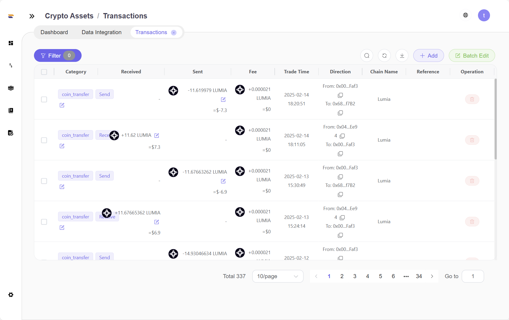

# Transactions - 交易明细

**功能概述 (Overview):**&#x5DF2;导入交易的查询功能。

**使用场景 (Use Cases):**&#x8FDB;行交易查询，对交易添加标签，修改特定交易价格时使用。

**界面描述 (UI Description):**&#x529F;能概述 (Overview)：展示用户加密资产交易详情。用户根据选择的不同查询条件，获取相匹配的交易详情数据。

#### 使用场景 (Use Cases)：用户想要了解所有或者匹配不同条件的交易详情。

#### 界面描述 (UI Description)：

在Transactions界面下，可以选取的匹配条件有标签，钱包和交易所，加密资产种类，期间，部门，地址。选择不同查询条件后会在下方展示所有匹配数据。若全部不选取，则展示所有交易数据。

<figure><figcaption></figcaption></figure>

注意事项：使用 Choose Period 按钮后，左侧期间开始时间和结束时间会自动填入对应时间。功能概述 (Overview)：展示用户加密资产交易详情。用户根据选择的不同查询条件，获取相匹配的交易详情数据。

#### 使用场景 (Use Cases)：用户想要了解所有或者匹配不同条件的交易详情。

#### 界面描述 (UI Description)：

在Transactions界面下，可以选取的匹配条件有标签，钱包和交易所，加密资产种类，期间，部门，地址。选择不同查询条件后会在下方展示所有匹配数据。若全部不选取，则展示所有交易数据。

<figure><figcaption></figcaption></figure>

注意事项：使用 Choose Period 按钮后，左侧期间开始时间和结束时间会自动填入对应时间。

<figure><figcaption></figcaption></figure>

**操作 (Step-by-Step Guide):**

· 交易记录筛选：点击Filter按钮打开筛选界面可以设置相关条件对交易记录进行筛选，获取所需交易记录

<figure><figcaption></figcaption></figure>

· 添加交易记录

<figure><figcaption>
步骤1：点击Add按钮
</figcaption></figure>

<figure><figcaption>
步骤2：填写交易信息，点击Save按钮保存
</figcaption></figure>

· 批量标记功能

<figure><figcaption>
步骤1：首先，在页面左侧勾选需要编辑标签的交易记录
</figcaption></figure>

<figure><figcaption>
步骤2：之后，点击Batch Edit按钮
</figcaption></figure>

<figure><figcaption>
步骤3：最后，在弹出的窗口中填写相关信息并进行确认即可完成批量标记
</figcaption></figure>

